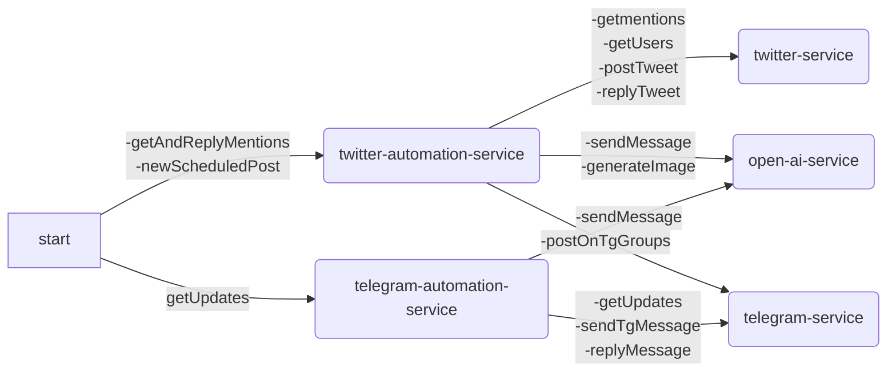

## Technology
- Node.js
- Express.js
- Sequelize ORM
- Typescript
- Docker
- Swagger
- Jest

## Integrations
- Twitter API
- Telegram API
- Open AI API

## Project Structure

```bash
/
└── src/                      # AI Agent System
    ├── config/               # Configuration Constants
    ├── constants/            # Application Constants
    ├── db/                   # Sequelize ORM models and implementations
    │   ├── config/           # Sequelize config
    │   ├── migrations/       # DB migrations
    │   └── models/           # Application models
    ├── docs/                 # Swagger Docs
    ├── middlewares/          # Application middlewares
    ├── prompts/              # Agent prompts
    ├── routes/               # API routes
    ├── services/             # Application services
    │   ├── agent-automation/ # Agent Automation Services
    │   ├── open-ai/          # Open AI Services
    │   ├── telegram/         # Telegram Services
    │   └── twitter/          # Twitter Services
    ├── tests/                # Test files
    ├── types/                # Typescript types
    └── utils/                # Utility functions
```

## Models
- *User*      - Represents an user in the system with an OpenAI thread attached to it
- *Mention*   - Represents an ingested twitter mention
- *TgMessage* - Represents an ingested telegram message
- *TgChat*    - Represents a telegram chat where the agent can post
- *Artwork*   - Represents a generated artwork
- *Activity*  - Represents an activity log

## Flow


